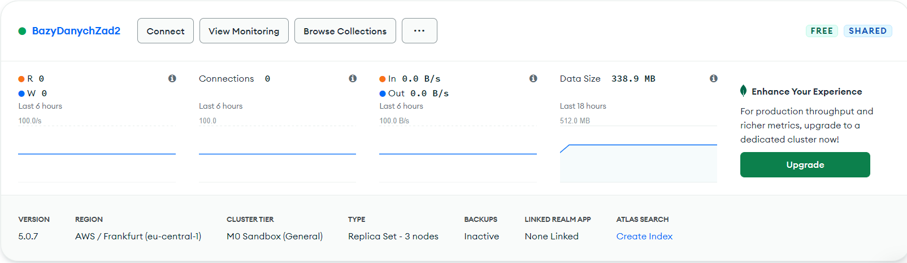
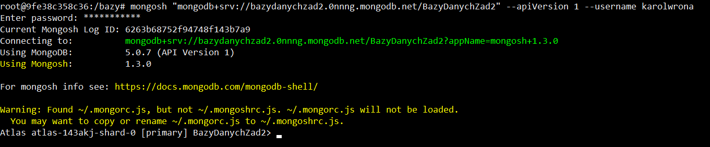
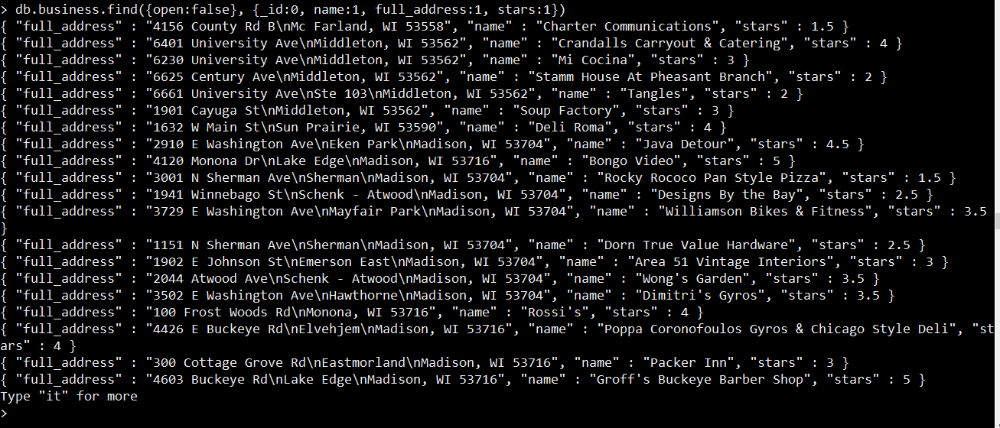
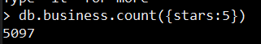
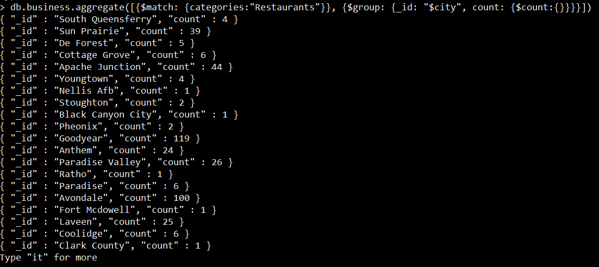
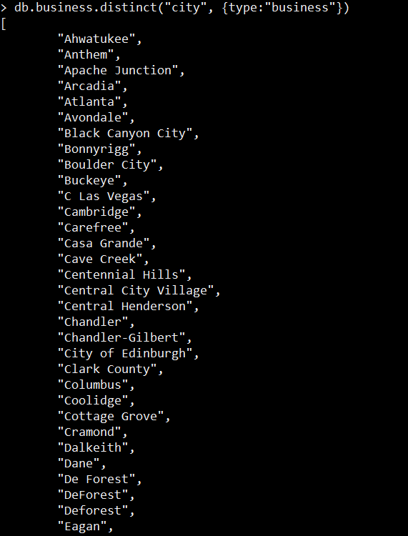

# Karol Wrona - MongoDB

- [Karol Wrona - MongoDB](#karol-wrona---mongodb)
  - [1. i 2. Serwer mongo](#1-i-2-serwer-mongo)
  - [3. Mongodb Atlas](#3-mongodb-atlas)
  - [4. Tworzenie kolekcji](#4-tworzenie-kolekcji)
  - [5. Zaimportuj przykładowe zbiory danych](#5-zaimportuj-przykładowe-zbiory-danych)
    - [MongoDB Atlas Sample Dataset](#mongodb-atlas-sample-dataset)
    - [Yelp Dataset](#yelp-dataset)
  - [6. Zapoznaj się z strukturą przykładowych zbiorów danych/kolekcji](#6-zapoznaj-się-z-strukturą-przykładowych-zbiorów-danychkolekcji)
  - [7. Operacje CRUD](#7-operacje-crud)
    - [Stworzenie bazy danych i kolekcji](#stworzenie-bazy-danych-i-kolekcji)
    - [Dodawanie dokumentów](#dodawanie-dokumentów)
    - [Modyfikacja dokumentów](#modyfikacja-dokumentów)
    - [Usuwanie dokumentów](#usuwanie-dokumentów)
    - [Operacje wyszukiwania dokumentów](#operacje-wyszukiwania-dokumentów)
  - [8.Operacje wyszukiwania danych](#8operacje-wyszukiwania-danych)
  - [Modelowanie Danych](#modelowanie-danych)
    - [Organizacja Danych](#organizacja-danych)
    - [companies](#companies)
    - [users](#users)
    - [tickets](#tickets)
    - [trips](#trips)
    - [Tworzenie bazy danych](#tworzenie-bazy-danych)
    - [Działania na bazie danych](#działania-na-bazie-danych)

Przykładowe dane na, których operowałem oraz "dumpy" bazy danych znajdują się w osobnych plikach.

<div style="page-break-after: always;"></div>

## 1. i 2. Serwer mongo

Wszystkie ćwiczenia wykonywałem za pomocą *Dockera*. Zatem procedura urchumienia lokalnego serwera mongo wyglądała następująco:

Windows shell:

```
> docker run --name mongodb -d -p 27017:27017 mongo
> docker exec -it mongodb /bin/bash
```

W kontenerze dockera:

```
> mongo
```

## 3. Mongodb Atlas

Utworzyłem serwer bazo danowych na serwisie mongodb Atlas, z przykładowym zbiorem danych:



Następnie przy pomocy komendy uzyskanej na stronie mongodb połączyłem się z serwerem



## 4. Tworzenie kolekcji

Proces tworzenia kolekcji jest opisany w podupunkcie *"7. Operacje CRUD"*. Proces tworzenia kolekcji na serwerze mongodb Atlas jest identyczny jak proces tworzenia kolekcji na serwerze lokalnym.

## 5. Zaimportuj przykładowe zbiory danych

Pliki pobrałem z strony podanej w instrukcji.

<div style="page-break-after: always;"></div>

### MongoDB Atlas Sample Dataset

Do zaimportowania tego zbioru danych użyłem komendy *mongorestore*.

```
> mongorestore -d KW sample_airbnb
```

Możemy teraz sprawdzić czy faktycznie kolekcja sample_airbnb została dodana do bazy KW.

```
> use KW
switched to db KW
> show collections
listingsAndReviews
> db.listingsAndReviews.find({}).count()
5555
```

A więc faktycznie zostały dodane wszystkie dane.

### Yelp Dataset

Do importu tego zbioru danych użyłem komendy *mongoimport*.

```
> mongoimport --db KW --collection yelp --type json 
        --file ./yelp_academic_dataset_business.json
```

Sprawdźmy czy faktycznie dane zostały dodane.

```
> use KW
switched to db KW
> show collections
listingsAndReviews
yelp
> db.yelp.find({}).count()
42153
```

<div style="page-break-after: always;"></div>


## 6. Zapoznaj się z strukturą przykładowych zbiorów danych/kolekcji

Zobaczmy przykładowy dokument z zbioru yelp_academic_dataset_business.json

```
{
        "_id" : ObjectId("6263c18722a588eec6df0e38"),
        "business_id" : "x7xS2DJvu8klyNzcpN8QHg",
        "full_address" : "2529 Allen Blvd\nMiddleton, WI 53562",
        "hours" : {
                "Monday" : {
                        "close" : "00:00",
                        "open" : "00:00"
                },
                "Tuesday" : {
                        "close" : "00:00",
                        "open" : "00:00"
                },
                "Friday" : {
                        "close" : "00:00",
                        "open" : "00:00"
                },
                "Wednesday" : {
                        "close" : "00:00",
                        "open" : "00:00"
                },
                "Thursday" : {
                        "close" : "00:00",
                        "open" : "00:00"
                },
                "Sunday" : {
                        "close" : "00:00",
                        "open" : "00:00"
                },
                "Saturday" : {
                        "close" : "00:00",
                        "open" : "00:00"
                }
        },
        "open" : true,
        "categories" : [
                "Pilates",
                "Yoga",
                "Weight Loss Centers",
                "Health & Medical",
                "Fitness & Instruction",
                "Active Life"
        ],
        "city" : "Middleton",
        "review_count" : 5,
        "name" : "Harbor Athletic Club",
        "neighborhoods" : [ ],
        "longitude" : -89.4860822,
        "state" : "WI",
        "stars" : 5,
        "latitude" : 43.1030719,
        "attributes" : {
                "By Appointment Only" : false,
                "Good for Kids" : true
        },
        "type" : "business"
}
```

Jak widać pierwszym polem obiektu jest *"_id"*, za pomocą którego możemy się do niego odwołać w innych dokumentach. Dokument zawiera także obiekt *"hours"* złożony z zagnieżdzonych obiektów reprezentujących godziny otwarcia w poszczególne dni. Dokument zawiera także dwie tablice, z czego jedna jest tablicą stringów, a druga jest w tym przypadku pusta. Dokument zawiera także kolejne zagnieżdzone obiekty pod polem *"attributes"*.

## 7. Operacje CRUD

### Stworzenie bazy danych i kolekcji

Stworzenie bazy danych:

```
> use KW
```

Stworzenie kolekcji student:

```
> db.createCollections("student")
```

Proponowana struktura dokumentu:

```
student1 = {
    albumIndex: int,
    name: string,
    surname: string,
    age: int,
    faculty: string,
    year: int,
    grades: [
        {subject: string, grade: int},
        ...
    ]
}
```

<div style="page-break-after: always;"></div>


### Dodawanie dokumentów

Dokumenty można dodawać za pomocą wywołań:

```
> db.student.insertOne({})
```

```
> db.student.insertMany([{}])
```

Dużo prościej jest jednak stworzyć gotowy plik json (np. w vimie) i z poziomu konsoli użyć komendy:

```
> mongoimport students.json --db="KW" --collection="student"
```

Aby wylistować dokumenty dodane do naszej komendy możemy użyć:

```
> db.student.find({})
```

Tak wygląda nasza kolekcja po wywołaniu ww. komendy:

```
{ "_id" : ObjectId("625c8c428d75782cd25f508c"), "albumIndex" : 5,
 "name" : "Mikolaj", "surname" : "Kopernik",
 "age" : 62, "faculty" : "IMIR", "year" : 2, "grades" : [
          { "subject" : "astronomy", "grade" : 5 },
           { "subject" : "music", "grade" : 5 },
            { "subject" : "WDI", "grade" : 5 } ] }
{ "_id" : ObjectId("625c8c428d75782cd25f508d"), "albumIndex" : 4,
 "name" : "Zbigniew", "surname" : "Wodecki",
 "age" : 60, "faculty" : "WIET", "year" : 4, "grades" : [
          { "subject" : "math", "grade" : 5 },
           { "subject" : "music", "grade" : 5 },
            { "subject" : "WDI", "grade" : 5 } ] }
{ "_id" : ObjectId("625c8c428d75782cd25f508e"), "albumIndex" : 6,
 "name" : "Jacek", "surname" : "Kaczmarczyk",
 "age" : 45, "faculty" : "AIR", "year" : 1, "grades" : [
          { "subject" : "history", "grade" : 5 },
           { "subject" : "music", "grade" : 5 },
            { "subject" : "WDI", "grade" : 5 } ] }
{ "_id" : ObjectId("625c8c428d75782cd25f508f"), "albumIndex" : 8,
 "name" : "Zbigniew", "surname" : "Lapinski",
 "age" : 60, "faculty" : "AIR", "year" : 4, "grades" : [
          { "subject" : "ASD", "grade" : 5 },
           { "subject" : "music", "grade" : 2 },
            { "subject" : "WDI", "grade" : 5 } ] }
{ "_id" : ObjectId("625c8c428d75782cd25f5090"), "albumIndex" : 9,
 "name" : "Zbigniew", "surname" : "Raubo",
 "age" : 57, "faculty" : "WIET", "year" : 4, "grades" : [ 
         { "subject" : "math", "grade" : 5 },
          { "subject" : "PE", "grade" : 3 },
           { "subject" : "WDI", "grade" : 5 } ] }
{ "_id" : ObjectId("625c8c428d75782cd25f5091"), "albumIndex" : 10,
 "name" : "Andrzej", "surname" : "Jankowski",
 "age" : 34, "faculty" : "WIMP", "year" : 2, "grades" : [
          { "subject" : "math", "grade" : 5 },
           { "subject" : "WDAI", "grade" : 5 },
            { "subject" : "WDI", "grade" : 5 } ] }
{ "_id" : ObjectId("625c8c428d75782cd25f5092"), "albumIndex" : 7,
 "name" : "Zbigniew", "surname" : "Gintrowski",
 "age" : 60, "faculty" : "AIR", "year" : 4, "grades" : [
          { "subject" : "math", "grade" : 5 },
           { "subject" : "music", "grade" : 3 },
            { "subject" : "WDI", "grade" : 5 } ] }
{ "_id" : ObjectId("625c8c428d75782cd25f5093"), "albumIndex" : 1,
 "name" : "Karol", "surname" : "Wrona",
 "age" : 20, "faculty" : "WIET", "year" : 2, "grades" : [
          { "subject" : "math", "grade" : 5 },
           { "subject" : "database", "grade" : 5 },
            { "subject" : "ASD", "grade" : 5 } ] }
{ "_id" : ObjectId("625c8c428d75782cd25f5094"), "albumIndex" : 3,
 "name" : "Jan", "surname" : "Kolodziej",
 "age" : 26, "faculty" : "WIET", "year" : 3, "grades" : [
          { "subject" : "math", "grade" : 5 },
           { "subject" : "database", "grade" : 5 },
            { "subject" : "ASD", "grade" : 5 } ] }
{ "_id" : ObjectId("625c8c428d75782cd25f5095"), "albumIndex" : 2,
 "name" : "Mariusz", "surname" : "Pudzianowski",
 "age" : 40, "faculty" : "WIET", "year" : 2, "grades" : [ 
         { "subject" : "PE", "grade" : 5 },
          { "subject" : "ASD", "grade" : 3 },
           { "subject" : "WDAI", "grade" : 5 } ] }
```

Spróbujmy wstawić teraz nowego studenta "Adam Gruszka" za pomocą funkcji *db.student.insertOne()*:

```
>  db.student.insertOne({albumIndex: 11, name: "Adam", surname: "Gruszka",
 age: 18, faculty: "WIMIR", year: 2, grades: [
        {subject: "math", grade: 5},
        {subject: "ASD", grade: 4}
]})
```

<div style="page-break-after: always;"></div>

Znajdźmy teraz naszego nowego studenta:

```
> db.student.find({name:"Adam"}).pretty()
{
        "_id" : ObjectId("625c8dfc00db0dde7f6d4aa4"),
        "albumIndex" : 11,
        "name" : "Adam",
        "surname" : "Gruszka",
        "age" : 18,
        "faculty" : "WIMIR",
        "year" : 2,
        "grades" : [
                {
                        "subject" : "math",
                        "grade" : 5
                },
                {
                        "subject" : "ASD",
                        "grade" : 4
                }
        ]
}
```


### Modyfikacja dokumentów

Spróbujmy sprawić by "Adam Gruszka" przeszedł z drugiego roku na trzeci. Użyjemy do tego komendy:

```
> db.student.updateOne({name: "Adam"}, {$set: {year: 3}})
```

Jak widać operacja powiodła się:

```
> db.student.find({name: "Adam"}, {year: 1, _id: 0, name: 1, surname: 1})
{ "name" : "Adam", "surname" : "Gruszka", "year" : 3 }
```

Spróbujmy teraz dla wszystkich studentów, którzy mają powyżej 50 lat, dodać pole *profesor:true* oraz usunąć pola *year* i *grades* :

```
> db.student.updateMany({age: {$gt: 50}}, {$set: {profesor: true}})
```

```
> db.student.updateMany({age: {$gt: 50}}, {$unset: {year: "", grades: ""}})
```

Oto lista naszych profesorów:

```
> db.student.find({profesor: true}).pretty()
{
        "_id" : ObjectId("625c92a2dc7746359a700547"),
        "albumIndex" : 4,
        "name" : "Zbigniew",
        "surname" : "Wodecki",
        "age" : 60,
        "faculty" : "WIET",
        "profesor" : true
}
{
        "_id" : ObjectId("625c92a2dc7746359a700548"),
        "albumIndex" : 9,
        "name" : "Zbigniew",
        "surname" : "Raubo",
        "age" : 57,
        "faculty" : "WIET",
        "profesor" : true
}
{
        "_id" : ObjectId("625c92a2dc7746359a70054a"),
        "albumIndex" : 8,
        "name" : "Zbigniew",
        "surname" : "Lapinski",
        "age" : 60,
        "faculty" : "AIR",
        "profesor" : true
}
{
        "_id" : ObjectId("625c92a2dc7746359a70054c"),
        "albumIndex" : 7,
        "name" : "Zbigniew",
        "surname" : "Gintrowski",
        "age" : 60,
        "faculty" : "AIR",
        "profesor" : true
}
{
        "_id" : ObjectId("625c92a2dc7746359a70054e"),
        "albumIndex" : 5,
        "name" : "Mikolaj",
        "surname" : "Kopernik",
        "age" : 62,
        "faculty" : "IMIR",
        "profesor" : true
}
```


Oczywiście profesorowie to nie studenci, a więc należało by stworzyć dla nich osobną kolekcję, jednak na potrzeby naszego ćwiczenia wystarczy, że zademonstrowaliśmy jak działa *db.student.updateMany()*

### Usuwanie dokumentów

Ostatecznie usuńmy naszego "Adama Gruszkę" z listy studentów.

```
> db.student.deleteOne({albumIndex: 11, name: "Adam", surname: "Gruszka"})
```

```
> db.student.find({name: "Adam"}).pretty()
>
```

Jak widać na liście studentów nie ma już "Adama Gruszki". Gdy chcemy usunąc więcej dokumentów naraz, możemu użyć:

```
> db.student.deleteMany()
```

Przy czym użycie:

```
> db.student.deleteMany({})
```

Usuwa wszystkie dokumenty.

### Operacje wyszukiwania dokumentów

Wykonajmy kilka przykładowych wyszukań.

1. Znajdź wszystkich studentów WIMP lub WIET na 2 roku:

```
> db.student.find({ $or: [
        {faculty: "WIET"},
        {faculty: "WIMP"}
        ],
        year: 2}).pretty()
{
        "_id" : ObjectId("625c92a2dc7746359a700549"),
        "albumIndex" : 10,
        "name" : "Andrzej",
        "surname" : "Jankowski",
        "age" : 34,
        "faculty" : "WIMP",
        "year" : 2,
        "grades" : [
                {
                        "subject" : "math",
                        "grade" : 5
                },
                {
                        "subject" : "WDAI",
                        "grade" : 5
                },
                {
                        "subject" : "WDI",
                        "grade" : 5
                }
        ]
}
{
        "_id" : ObjectId("625c92a2dc7746359a70054b"),
        "albumIndex" : 2,
        "name" : "Mariusz",
        "surname" : "Pudzianowski",
        "age" : 40,
        "faculty" : "WIET",
        "year" : 2,
        "grades" : [
                {
                        "subject" : "PE",
                        "grade" : 5
                },
                {
                        "subject" : "ASD",
                        "grade" : 3
                },
                {
                        "subject" : "WDAI",
                        "grade" : 5
                }
        ]
}
{
        "_id" : ObjectId("625c92a2dc7746359a70054f"),
        "albumIndex" : 1,
        "name" : "Karol",
        "surname" : "Wrona",
        "age" : 20,
        "faculty" : "WIET",
        "year" : 2,
        "grades" : [
                {
                        "subject" : "math",
                        "grade" : 5
                },
                {
                        "subject" : "database",
                        "grade" : 5
                },
                {
                        "subject" : "ASD",
                        "grade" : 5
                }
        ]
}
```

2. Znajdź wszystkich studentów z oceną z ASD niższą niż 5:

```
> db.student.find({grades:{$elemMatch:
 {subject:"ASD", grade:{$lt:5}}}}).pretty()
{
        "_id" : ObjectId("625c92a2dc7746359a70054b"),
        "albumIndex" : 2,
        "name" : "Mariusz",
        "surname" : "Pudzianowski",
        "age" : 40,
        "faculty" : "WIET",
        "year" : 2,
        "grades" : [
                {
                        "subject" : "PE",
                        "grade" : 5
                },
                {
                        "subject" : "ASD",
                        "grade" : 3
                },
                {
                        "subject" : "WDAI",
                        "grade" : 5
                }
        ]
}
```

3. Znajdź wszystkich studentów, którzy mają oceny z matematyki: 

```
> db.student.find({grades: {$elemMatch: {subject: "math"}}}).pretty()
{
        "_id" : ObjectId("625c92a2dc7746359a700546"),
        "albumIndex" : 3,
        "name" : "Jan",
        "surname" : "Kolodziej",
        "age" : 26,
        "faculty" : "WIET",
        "year" : 3,
        "grades" : [
                {
                        "subject" : "math",
                        "grade" : 5
                },
                {
                        "subject" : "database",
                        "grade" : 5
                },
                {
                        "subject" : "ASD",
                        "grade" : 5
                }
        ]
}
{
        "_id" : ObjectId("625c92a2dc7746359a700549"),
        "albumIndex" : 10,
        "name" : "Andrzej",
        "surname" : "Jankowski",
        "age" : 34,
        "faculty" : "WIMP",
        "year" : 2,
        "grades" : [
                {
                        "subject" : "math",
                        "grade" : 5
                },
                {
                        "subject" : "WDAI",
                        "grade" : 5
                },
                {
                        "subject" : "WDI",
                        "grade" : 5
                }
        ]
}
{
        "_id" : ObjectId("625c92a2dc7746359a70054f"),
        "albumIndex" : 1,
        "name" : "Karol",
        "surname" : "Wrona",
        "age" : 20,
        "faculty" : "WIET",
        "year" : 2,
        "grades" : [
                {
                        "subject" : "math",
                        "grade" : 5
                },
                {
                        "subject" : "database",
                        "grade" : 5
                },
                {
                        "subject" : "ASD",
                        "grade" : 5
                }
        ]
}
```

## 8.Operacje wyszukiwania danych

a) Zwróć dane wszystkich zamkniętych (open) firm (business). Zapytanie powinno zwracać dane z pól: nazwa, adres, gwiazdki (stars).

Do tego zadania użyjemy komendy:

```
> db.business.find({open: false},
 {_id: 0, name: 1, full_address: 1, stars: 1})
```

Pierwszy obiekt to ustawienia filtrowania, drugi natomiast ustawia, które informacje zostaną wypisane.

<div style="page-break-after: always;"></div>

wynik:



Dodając do wywołania komendy .count() możemy łatwo sprawdzić, że wyników jest dużo więcej:

```
> db.business.find({open: false},
 {_id: 0, name: 1, full_address: 1, stars: 1}).count()
5008
```

Do dalszych recordów możemy dostać się wpisując *it* na konosli.

b) Ile miejsc ocenianych na 5 gwiazdek (pole stars, kolekcja business).

Do tego zadania użyjemy komendy:

```
> db.business.count({stars: 5})
```

co jest równoważne :

```
> db.business.find({stars: 5}).count()
```

wynik działania:



<div style="page-break-after: always;"></div>

c) Ile restauracji znajduje się w każdym mieście. (pole categories w dokumencie business musi zawierać wartość Restaurants).

Użyjemy komendy:

```
> db.business.aggregate([{$match: {categories: "Restaurants"}},
 {$group: {_id: "$city", count: {$count:{}}}}])
```



Ponownie wyników jest więcej niż zostało wypisanych na konsole, jeśli chcemy to możemy je zobaczyć wpisując *it* w konsoli.

<div style="page-break-after: always;"></div>

d) Zwróć bez powtórzeń wszystkie nazwy miast w których znajdują się firmy (business)

Użyjemy do tego komendy:

```
> db.business.distinct("city", {type: "business"})
```

Oto pierwsze kilanaście miast, które dostaliśmy:



<div style="page-break-after: always;"></div>

## Modelowanie Danych

Wybrałem opcje B.

### Organizacja Danych

W naszej bazie będą znajdowały się trzy kolekcje: *companies*, *users*, *trips*.

### companies

Tak wygląda struktura dokumentu w kolekcji *companies*:

```
company = {
    company_id: ObjectID,
    name: string,
    address: {
        country: string,
        city: string,
        postal-code: string,
        street: string
    },
    phone-number: string,
    NIP: int,
    trips: [
        trip_id: ObjectID,
        ...
    ]
}
```

Address postanowiłem trzymać jako dokument zagnieżdzony, ponieważ pozwala to na otrzymanie i modyfikowanie adressu za pomocą pojedynczych operacji na bazie danych. Jest to *zdenormalizowany* model danych, który jednak w bazach dokumentowych jest jak najbardziej akceptowalny. Mamy też tablice trips w której przetrzymujemy *trip_id* wycieczek organizowanych przez daną firmę, zastosowanie referencji do dokumentów w kolekcji trips, pozwala nam uniknąć powielenia danych. Jest to *znormalizowany* model danych. Ponieważ przechowujemy tylko id obiektów z innej kolekcji, nie musimy się martwić o atomiczność transakcji.

<div style="page-break-after: always;"></div>


### users

Tak wygląda struktura dokumentu kolekcji *users*:

```
user = {
    user_id: ObjectID,
    name: string,
    surname: string,
    address: {
        country: string,
        city: string,
        postal-code: string,
        street: string
    },
    phone-number: string,
    enlisted: [
        trip_id: ObjectID,
        ...
    ]
    rated: [
        trip_id: ObjectID,
        ...
    ]

}
```

Ta kolekcja poza oczywistymi polami posiada także tablice *enlisted*, przechowującą informacje o wycieczkach na jakie użytkownik się zapisał, oraz tablicę rated z id wycieczek, które użytkownik ocenił. 

### tickets

Dodatkowo zdecydowałem się stworzenie tablicy tickets:

```
trip-ticket = {
    trip_id: ObjectID,
    tickets: [
        {user_id: ObjectID, price: int},
        ...
    ]
}
```

Zakładamy, że jeśli użytkownik chcę zarezerwować wiele miejsc to jest to równoważne kupieniu kilku biletów. O tej tabeli opowiem trochę więcej w następnym podpunkcie.

<div style="page-break-after: always;"></div>


### trips

Tak wygląda struktura dokumentu kolekcji *trips*:

```
trip = {
    trip_id: ObjectID,
    name: string,
    organised-by: ObjectID,
    start-date: string,
    end-date: string,
    destination: {
        country: string,
        city: string,
    }
    opinions: [
        {user_id: ObjectID, stars: int, comment: string},
        ...
    ]
    max-no-of-places: int,
    
}
```

Tutaj warto zastanowić się nad pewnymi rozwiązaniami. Dokument *trip* nie zawiera, żadnej informacji o dostępnych miejscach lub wykupionych biletach, wszystkie te informacje znajdują się w kolekcji *tickets*. Zdecydowałem się na takie rozwiązanie aby zapewnić atomicznośc operacji kupowania nowych biletów, np. gdyby w dokumecie trip znajdowała się tablica z biletami wykupionymi przez użytkowników (w takim wypadku tablica tickets by nie istniała), to owszem bardzo łatwo byłoby otrzymać informację o dostępnych miejscach na danej wycieczce, jednak kupienie biletu wymagało by wtedy zaktualizowania kolekcji *users*, oraz *trips*. Ponieważ transakcje na wielu dokumetach są bardziej kosztowne niż operacje na pojedynczym dokumecie, zdecydowałem się wydzielić kolekcje tickets zajmującą się przechowywaniem informacji o biletach. Kolejnymi zaletami mojego rozwiązania jest fakt, że w łatwy sposób można sprawdzić ile jest wolnych miejsc na wycieczce, wystarczy wysłać podzapytanie do kolekcji *trip_tickets*, znaleźć dokument odpowiedzialny za daną kolekcję oraz zliczyć ile zostało zakupionych biletów. Ponieważ liczenie wolnych miejsc, oraz dodawania nowych biletów odbywa się w jednym i tym samym dokumencie, możemy zagwaratnować spójność informacji. Jeśli klient chcę dostać informację o zakupionych przez siebie biletach, może to zrobić szukając osobno biletów dla każdej wycieczki z *enlisted*. Uważam, że takie rozwiązanie powinno się sprawić nawet przy dużych kolekcjach danych, jednak gdyby okazało się, że czas wykonywania operacji na bazie danych wzrósł, można by utworzyć kolekcje *ticket_archive*, gdzie przechowywalibyśmy informację o wycieczkach które odbyły się np. rok temu.

Jeśli chodzi natomiast o oceny, zdecydowałem się przechowywać informacje o ocenach i komentarzach w *trips*, natomiast w dokumentach *users* przechowywać informację tylko o ocenionych wycieczkach.

<div style="page-break-after: always;"></div>


### Tworzenie bazy danych

Na początku stwórzmy bazę danych i kolekcje:

```
> use KW
switched to db KW
> db.createCollection("companies")
{ "ok" : 1 }
> db.createCollection("users")
{ "ok" : 1 }
> db.createCollection("tickets")
{ "ok" : 1 }
> db.createCollection("trips")
{ "ok" : 1 }
```

W edytorze tekstowym stworzyłem pliki json i za pomocą *mongoimoport* dodałem je do odpowiednich kolekcji.

<div style="page-break-after: always;"></div>

### Działania na bazie danych

1. Dostań wszystkich uczestników wycieczki nr.2:

```
> db.users.find( {enlisted : 2} ).pretty()
{
        "_id" : ObjectId("626463373680703f11b05943"),
        "user_id" : 0,
        "name" : "Adam",
        "surname" : "Gruszka",
        "address" : {
                "country" : "Poland",
                "city" : "Cracow",
                "postal-code" : "32-523",
                "street" : "Kolejowska 9"
        },
        "phone-number" : "123456789",
        "enlisted" : [
                0,
                1,
                2,
                3
        ],
        "rated" : [
                0,
                1,
                2,
                3
        ]
}
{
        "_id" : ObjectId("626463373680703f11b05945"),
        "user_id" : 1,
        "name" : "Marcin",
        "surname" : "Pietruszka",
        "address" : {
                "country" : "Poland",
                "city" : "Warsaw",
                "postal-code" : "12-523",
                "street" : "Francuska 1"
        },
        "phone-number" : "319876345",
        "enlisted" : [
                0,
                1,
                2
        ],
        "rated" : [ ]
}
>
```

<div style="page-break-after: always;"></div>


2. Sprawdź ile jest wolnych miejsc dla wycieczki nr.1:

Najpierw sprawdźmy ile jest maksymalnie wolnych miejsc dla danej wycieczki:

```
> db.trips.find({trip_id : 2}, {_id : 0, "max-no-of-places" : 1})
{ "max-no-of-places" : 12 }
```

Teraz sprawdźmy ile jest zajętych miejsc:

```
> db.tickets.aggregate([{ $match: { trip_id : 2 }},
 {$project : { _id : 0, count : { $size : "$tickets"}}}])
{ "count" : 2 }
```

Te dwa wywołania zwracają nam obiekty json które łatwo można rozpakować po stronie aplikacji i obliczyć ilość dostępnych miejsc.

3. Zwróć użytkownika, który wystawił największą ilość ocen:

Taka komenda zwraca nam obiekt z użytkownikiem, który wystawił największą ilość ocen.

```
> db.users.aggregate([{$project : { name : 1, count : { $size :"$rated"}}},
 {$sort : { count : -1}}]).toArray()[0]
{
        "_id" : ObjectId("626463373680703f11b05943"),
        "name" : "Adam",
        "count" : 4
}
```

4. Dla danego użytkownika zwróć nazwy wycieczek na, które jest zapisany:

 ```
> db.users.aggregate([{$match : {user_id: 2}},
 {$lookup : {
        from: "trips",
        localField: "enlisted",
        foreignField: "trip_id",
        as: "trips"}},
 {$project : {_id : 0, trips: { name : 1 }}}]).pretty()
{
        "trips" : [
                {
                        "name" : "Zwiedzanie Krakowa"
                },
                {
                        "name" : "Kajaki w Gorach"
                }
        ]
}
 ```