# Karol Wrona - Entity Framework

## Dodawanie dostawcy

### 1. Relacja Product Supplier

Stworzyłem nową klasę *Supplier*:

```c#
    public class Supplier
    {
        public int SupplierID { get; set; }
        public string? CompanyName { get; set; }
        public string? Street { get; set; }
        public string? City { get; set; }
    }
```

Oraz dodałem nowe pole w klasie *Product*:

```c#
    public class Product
    {
        public int ProductID { get; set; }
        public string? ProductName { get; set; }
        public int UnitsOnStock { get; set; }
        public Supplier? IsSuppliedBy { get; set; }
    }
```

A także dodałem nowy dataSet w *ProductContext*:

```c#
    public class ProductContext : DbContext
    {
        public DbSet<Product> Products { get; set; }
        public DbSet<Supplier> Suppliers { get; set; }
        protected override void OnConfiguring(DbContextOptionsBuilder optionsBuilder)
        {
            base.OnConfiguring(optionsBuilder);
            optionsBuilder.UseSqlite("Datasource=ProductsDatabase");
        }
    }
```

Tak wygląda schemat bazy danych:


Dodajmy teraz nowego dostawce:

```c#
ProductContext productContex = new ProductContext();

Supplier supplier = new Supplier { CompanyName="Mlekopol", City="Cracow", Street="Reymonta" };
productContex.Suppliers.Add(supplier);
productContex.SaveChanges();
```

Teraz dodajmy dostawce do pola IsSuppliedBy naszego produktu:

```c#
ProductContext productContex = new ProductContext();

var prod = productContex.Products.SingleOrDefault(p => p.ProductName == "mazak");
var sup = productContex.Suppliers.SingleOrDefault(s => s.CompanyName == "Mlekopol");
if (prod != null && sup != null)
{
    prod.IsSuppliedBy = sup;
    productContex.SaveChanges();
}
```

Sprawdźmy teraz za pomocą dataGripa jak wygląda nasza baza danych

```sql
select * from Products;
select * from Suppliers;
```


## 2. Odwracanie relacji

Tak wygląda klasa *Product*:

```c#
    public class Product
    {
        public int ProductID { get; set; }
        public string? ProductName { get; set; }
        public int UnitsOnStock { get; set; }
    }
```

A tak wygląda klasa *Supplier*:

```c#
    public class Supplier
    {
        public int SupplierID { get; set; }
        public string? CompanyName { get; set; }
        public string? Street { get; set; }
        public string? City { get; set; }
        public ICollection<Product> Supplies { get; set; }
    }
```

Następnie po wykonaniu migracji oraz update'u bazy danych wykonujemy kod:

```c#
ProductContext productContext = new ProductContext();

Product flamaster = new Product { ProductName="flamaster", UnitsOnStock=2};
Product kreda = new Product { ProductName = "kreda", UnitsOnStock = 3 };
Product dlugopis= new Product { ProductName = "dlugopis", UnitsOnStock = 1 };
Product linijka = new Product { ProductName = "linijka", UnitsOnStock = 5 };
Product ekierka = new Product { ProductName = "ekierka", UnitsOnStock = 3 };

Supplier supplier1 = new Supplier { CompanyName = "PisadlaCompany", City = "Cracow", Street = "Reymonta", Supplies = new LinkedList<Product>() };
Supplier supplier2 = new Supplier { CompanyName = "Linijka&Ekierka", City = "Cracow", Street = "Nawojki", Supplies = new LinkedList<Product>() };
supplier1.Supplies.Add(flamaster);
supplier1.Supplies.Add(kreda);
supplier1.Supplies.Add(dlugopis);
supplier2.Supplies.Add(linijka);
supplier2.Supplies.Add(ekierka);

productContext.Products.Add(flamaster);
productContext.Products.Add(kreda);
productContext.Products.Add(dlugopis);
productContext.Products.Add(linijka);
productContext.Products.Add(ekierka);

productContext.Suppliers.Add(supplier1);
productContext.Suppliers.Add(supplier2);

productContext.SaveChanges();
```

Sprawdźmy więc jak wygląda nasza baza danych.

Tak wygląda schemat bazy:

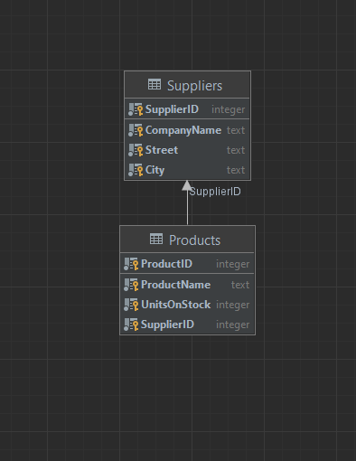

A tak wyglądają tabele

```sql
select * from Products;
select * from Suppliers;
```

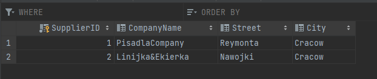

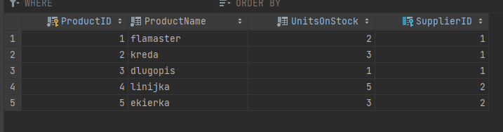

Na tym przykładzie możemy dokonać ciekawej obserwacji. Jak widać w naszej tabeli *Suppliers* nie ma kolumny *Supplies*, to dlatego, że byłoby to bez sensu bo relacyjna baza danych nie wspiera takiego typu wartości. Zamiast tego widzimy pole *SupplierID* w tabeli *Products*, pokazuje to jak w rzeczywistości działa code-first approach, my jako programiści tworzymy pewną logikę zrozumiałą dla nas oraz dla c#. Natomiast Entity framework tłumaczy tą logikę na świat relacyjnych baz danych.

## 3. Relacja dwustronna

Zacznijmy od usunięcia danych:

```c#
ProductContext productContext = new ProductContext();

var query = from prod in productContext.Products
            select prod;

var query2 = from sup in productContext.Suppliers
             select sup;

foreach (var product in query)
{
    productContext.Remove(product);
}

foreach (var sup in query2)
{
    productContext.Remove(sup);
}

productContext.SaveChanges();
```

Następnie zmodyfikujmy klasę *Product*:

```c#
    public class Product
    {
        public int ProductID { get; set; }
        public string ProductName { get; set; }
        public int UnitsOnStock{ get; set; }

        public Supplier SuppliedBy { get; set; }
    }
```

I ostatecznie dodajmy na nowo produkty:

```c#
ProductContext productContext = new ProductContext();

Product flamaster = new Product { ProductName = "flamaster", UnitsOnStock = 2 };
Product kreda = new Product { ProductName = "kreda", UnitsOnStock = 3 };
Product dlugopis = new Product { ProductName = "dlugopis", UnitsOnStock = 1 };
Product linijka = new Product { ProductName = "linijka", UnitsOnStock = 5 };
Product ekierka = new Product { ProductName = "ekierka", UnitsOnStock = 3 };

Supplier supplier1 = new Supplier { CompanyName = "PisadlaCompany", City = "Cracow", Street = "Reymonta", Supplies = new LinkedList<Product>() };
Supplier supplier2 = new Supplier { CompanyName = "Linijka&Ekierka", City = "Cracow", Street = "Nawojki", Supplies = new LinkedList<Product>() };
supplier1.Supplies.Add(flamaster);
supplier1.Supplies.Add(kreda);
supplier1.Supplies.Add(dlugopis);
supplier2.Supplies.Add(linijka);
supplier2.Supplies.Add(ekierka);

flamaster.SuppliedBy = supplier1;
kreda.SuppliedBy = supplier1;
dlugopis.SuppliedBy = supplier1;
linijka.SuppliedBy = supplier2;
ekierka.SuppliedBy = supplier2;

productContext.Products.Add(flamaster);
productContext.Products.Add(kreda);
productContext.Products.Add(dlugopis);
productContext.Products.Add(linijka);
productContext.Products.Add(ekierka);

productContext.SaveChanges();
```

Tak wygląda schemat bazy danych:

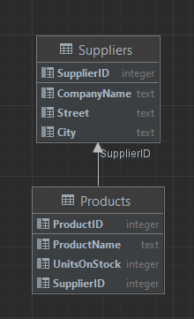

Zobaczmy jak wyglądają tabele:

```sql
select * from Products;
select * from Suppliers;
```

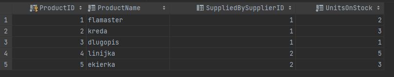

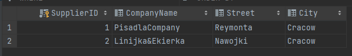

Ponownie widać, że struktura kodu jest inna niż struktura bazy danych.

## 4. Many to many

Zaczynami od usunięcia produktów z bazy danych. Następnie dodajemy klasę *Invoice*:

```c#
using System.ComponentModel.DataAnnotations;

namespace KarolWronaEFProducts
{
    public class Invoice
    {
        [Key]
        public int InvoiceNumber { get; set; }
        public int Quantity { get; set; }
        public ICollection<Product> Includes { get; set; }
    }
}
```

Tutaj musieliśmy dodać także specjalnego usinga.

Modyfikujemy klaśe *Product* oraz *ProductContext*:

```c#
    public class Product
    {
        public int ProductID { get; set; }
        public string ProductName { get; set; }
        public int UnitsOnStock{ get; set; }

        public Supplier SuppliedBy { get; set; }

        public ICollection<Invoice> CanBeSoldIn { get; set; }

    }
```

```c#
    public class ProductContext : DbContext
    {
        public DbSet<Product> Products { get; set; }
        public DbSet<Supplier> Suppliers { get; set; }
        public DbSet<Invoice> Invoices { get; set; }


        protected override void OnConfiguring(DbContextOptionsBuilder optionsBuilder)
        {
            base.OnConfiguring(optionsBuilder);
            optionsBuilder.UseSqlite("Datasource=ProductDatabase");
        }
    }
```

Teraz dodajmy nowe dane do bazy danych:

```c#
ProductContext productContext = new ProductContext();

Product flamaster = new Product { ProductName = "flamaster", UnitsOnStock = 2, CanBeSoldIn = new LinkedList<Invoice>() };
Product kreda = new Product { ProductName = "kreda", UnitsOnStock = 3, CanBeSoldIn = new LinkedList<Invoice>() };
Product dlugopis = new Product { ProductName = "dlugopis", UnitsOnStock = 1, CanBeSoldIn = new LinkedList<Invoice>() };
Product linijka = new Product { ProductName = "linijka", UnitsOnStock = 5, CanBeSoldIn = new LinkedList<Invoice>() };
Product ekierka = new Product { ProductName = "ekierka", UnitsOnStock = 3, CanBeSoldIn = new LinkedList<Invoice>() };

Invoice invoice1 = new Invoice { Quantity = 1 , Includes = new LinkedList<Product>()};
Invoice invoice2 = new Invoice { Quantity = 1 , Includes = new LinkedList<Product>() };

flamaster.CanBeSoldIn.Add(invoice1);
flamaster.CanBeSoldIn.Add(invoice2);
kreda.CanBeSoldIn.Add(invoice1);
dlugopis.CanBeSoldIn.Add(invoice1);
linijka.CanBeSoldIn.Add(invoice2);
ekierka.CanBeSoldIn.Add(invoice2);

invoice1.Includes.Add(flamaster);
invoice1.Includes.Add(kreda);
invoice1.Includes.Add(dlugopis);
invoice2.Includes.Add(linijka);
invoice2.Includes.Add(ekierka);
invoice2.Includes.Add(flamaster);

Supplier supplier1 = new Supplier { CompanyName = "PisadlaCompany", City = "Cracow", Street = "Reymonta", Supplies = new LinkedList<Product>() };
Supplier supplier2 = new Supplier { CompanyName = "Linijka&Ekierka", City = "Cracow", Street = "Nawojki", Supplies = new LinkedList<Product>() };
supplier1.Supplies.Add(flamaster);
supplier1.Supplies.Add(kreda);
supplier1.Supplies.Add(dlugopis);
supplier2.Supplies.Add(linijka);
supplier2.Supplies.Add(ekierka);

flamaster.SuppliedBy = supplier1;
kreda.SuppliedBy = supplier1;
dlugopis.SuppliedBy = supplier1;
linijka.SuppliedBy = supplier2;
ekierka.SuppliedBy = supplier2;

productContext.Products.Add(flamaster);
productContext.Products.Add(kreda);
productContext.Products.Add(dlugopis);
productContext.Products.Add(linijka);
productContext.Products.Add(ekierka);

productContext.Invoices.Add(invoice1);
productContext.Invoices.Add(invoice2);

productContext.Suppliers.Add(supplier1);
productContext.Suppliers.Add(supplier2);

productContext.SaveChanges();
```

Sprawdźmy jak wygląda schemat naszej bazy Danych:

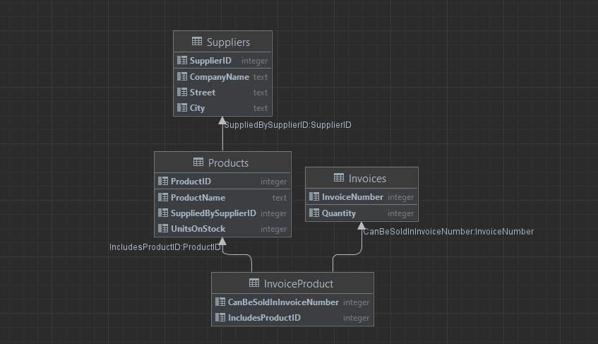

Wbrew pozorom entity framework jest dość inteligentny, aby zamodelować zadaną przez nas relację stworzył on nową tablicę *Invoice Product*, dokładnie tak jakbyśmy to robili modelując bazę danych w pierwszej kolejności.

Wykonajmy teraz kilka podzapytań do naszej bazy danych.

Wypisz listę produktów z danej faktury:

```c#
var query = from invoice in productContext.Invoices
            where invoice.InvoiceNumber == 1
            select invoice.Includes;

Console.WriteLine("Products buy in invoice nr1: ");
foreach (var invoice in query)
{
    foreach (var prod in invoice)
    {
        Console.WriteLine(prod.ProductName);
    }
}
```

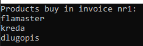

Wypisz listę faktur w których występował dany produkt:

```c#
var query = from product in productContext.Products
            where product.ProductID == 1
            select product.CanBeSoldIn;

Console.WriteLine("Invoices where product nr.1 was sold: ");
foreach (var item in query)
{
    foreach (var invoice in item)
    {
        Console.WriteLine(invoice.InvoiceNumber);
    }
}
```

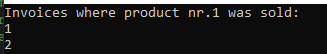


## 5. Dziedziczenie

Klasycznie rozpocząłem od wyczeszczenia danych. Następnie dodałem naszą nową klasę *Company*:


```c#
namespace KarolWronaEFProducts
{
    public class Company
    {
        public int CompanyID { get; set; }
        public string CompanyName { get; set; }
        public string Street { get; set; }
        public string City { get; set; }
        public string ZipCode { get; set; }
    }
}
```

Dodałem dwie klasy dziedziczące po niej:

```c#
namespace KarolWronaEFProducts
{
    public class Customer : Company
    {
        public decimal? Discount { get; set; }
    }
}
```


```c#
namespace KarolWronaEFProducts
{
    public class Supplier : Company
    {
        public string? BankAccountNumber { get; set; }
    }
}
```

Aby wszystko zadziałało trzeba jeszcze dokonać paru zmian w *ProductContext*:

```c#
    public class ProductContext : DbContext
    {
        public DbSet<Product> Products { get; set; }
        public DbSet<Company> Companies { get; set; }
        public DbSet<Invoice> Invoices { get; set; }


        protected override void OnConfiguring(DbContextOptionsBuilder optionsBuilder)
        {
            base.OnConfiguring(optionsBuilder);
            optionsBuilder.UseSqlite("Datasource=ProductDatabase");
        }

        protected override void OnModelCreating(ModelBuilder modelBuilder)
        {
            modelBuilder.Entity<Customer>();
            modelBuilder.Entity<Supplier>();
        }
    }
```

Teraz możemy dodać nowe dane do bazy danych.

```c#
ProductContext productContext = new ProductContext();

Company supplier1 = new Supplier { CompanyName = "PisadlaCompany", City = "Cracow", Street = "Reymonta", ZipCode = "12-123", BankAccountNumber = "123456789" };
Company supplier2 = new Supplier { CompanyName = "Linijka&Ekierka", City = "Cracow", Street = "Nawojki", ZipCode = "12-345", BankAccountNumber = "987654321" };

Company person1 = new Customer { CompanyName = "Maciej", City = "Warsaw", Street = "Marszalkowska", ZipCode = "31-234", Discount = 0.12M };
Company person2 = new Customer { CompanyName = "Adam", City = "Wroclaw", Street = "Slodowa", ZipCode = "35-234", Discount = 0.8M };

productContext.Companies.Add(person1);
productContext.Companies.Add(person2);
productContext.Companies.Add(supplier1);
productContext.Companies.Add(supplier2);

productContext.SaveChanges();
```

Sprawdźmy jak wygląda nasza baza danych:

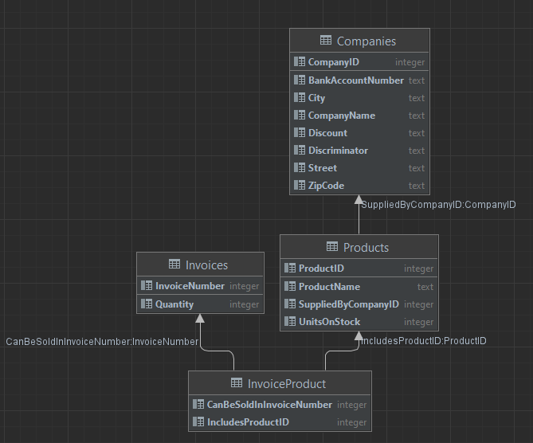

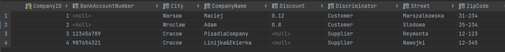

Jak widać entity framework wyśmieniecie poradził sobie z tym zadaniem i utworzył jedną wspólną tabele, która zawiera kolumny właściwe dla klasy nadrzędnej i wszystkich klas dziedziczących po niej. Framework dodał nawet kolumnę *Discriminator*, która pozwala na odróźnienie jakiej klasy jest dana encja.

Wykonajmy kilka pod zapytań do naszej bazy danych:

```c#
var query = from comp in productContext.Companies
            where comp.CompanyID == 1
            select comp.CompanyName;

Console.WriteLine("Name of company with CompanyID = 1");
foreach (var name in query)
{
    Console.WriteLine(name);
}

var query2 = from comp in productContext.Companies
             where comp.CompanyID == 3
             select comp.CompanyName;

Console.WriteLine("Name of company with CompanyID = 3");
foreach (var name in query2)
{
    Console.WriteLine(name);
}
```

I dostajemy taki oto rezultat:

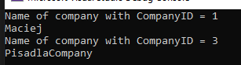

