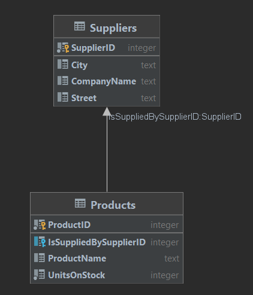

# Karol Wrona - Entity Framework

## Dodawanie dostawcy

### 1. Relacja Product Supplier

Stworzyłem nową klasę *Supplier*:

```c#
    public class Supplier
    {
        public int SupplierID { get; set; }
        public string? CompanyName { get; set; }
        public string? Street { get; set; }
        public string? City { get; set; }
    }
```

Oraz dodałem nowe pole w klasie *Product*:

```c#
    public class Product
    {
        public int ProductID { get; set; }
        public string? ProductName { get; set; }
        public int UnitsOnStock { get; set; }
        public Supplier? IsSuppliedBy { get; set; }
    }
```

A także dodałem nowy dataSet w *ProductContext*:

```c#
    public class ProductContext : DbContext
    {
        public DbSet<Product> Products { get; set; }
        public DbSet<Supplier> Suppliers { get; set; }
        protected override void OnConfiguring(DbContextOptionsBuilder optionsBuilder)
        {
            base.OnConfiguring(optionsBuilder);
            optionsBuilder.UseSqlite("Datasource=ProductsDatabase");
        }
    }
```

Tak wygląda schemat bazy danych:



Dodajmy teraz nowego dostawce:

```c#
ProductContext productContex = new ProductContext();

Supplier supplier = new Supplier { CompanyName="Mlekopol", City="Cracow", Street="Reymonta" };
productContex.Suppliers.Add(supplier);
productContex.SaveChanges();
```

Teraz dodajmy dostawce do pola IsSuppliedBy naszego produktu:

```c#
ProductContext productContex = new ProductContext();

var prod = productContex.Products.SingleOrDefault(p => p.ProductName == "mazak");
var sup = productContex.Suppliers.SingleOrDefault(s => s.CompanyName == "Mlekopol");
if (prod != null && sup != null)
{
    prod.IsSuppliedBy = sup;
    productContex.SaveChanges();
}
```

Sprawdźmy teraz za pomocą dataGripa jak wygląda nasza baza danych

```sql
select * from Products;
select * from Suppliers;
```


## 2. Odwracanie relacji

Najpierw usuńmy dane z tabeli:

```c#
ProductContext productContex = new ProductContext();

var prod = productContex.Products.SingleOrDefault(p => p.ProductName == "mazak");
var sup = productContex.Suppliers.SingleOrDefault(s => s.CompanyName == "Mlekopol");
if (prod != null && sup != null)
{
    productContex.Remove(prod);
    productContex.Remove(sup);
    productContex.SaveChanges();
}
```

Tak wygląda klasa *Product*:

```c#
    public class Product
    {
        public int ProductID { get; set; }
        public string? ProductName { get; set; }
        public int UnitsOnStock { get; set; }
    }
```

A tak wygląda klasa *Supplier*:

```c#
    public class Supplier
    {
        public int SupplierID { get; set; }
        public string? CompanyName { get; set; }
        public string? Street { get; set; }
        public string? City { get; set; }
        public ICollection<Product> Supplies { get; set; }
    }
```

