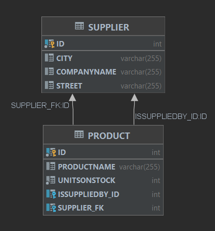

# Karol Wrona

- [Karol Wrona](#karol-wrona)
  - [Dodanie Suppliera](#dodanie-suppliera)
  - [Odwrócenie relacji z tabelą łącznikową](#odwrócenie-relacji-z-tabelą-łącznikową)
  - [Odwrócenie relacji bez tabeli łącznikowej](#odwrócenie-relacji-bez-tabeli-łącznikowej)
  - [Relacja dwustronna](#relacja-dwustronna)
  - [Dodanie Categories](#dodanie-categories)
  - [Dodanie Invoices](#dodanie-invoices)
  - [JPA](#jpa)
  - [Operacje kaskadowe](#operacje-kaskadowe)
  - [Embedded class](#embedded-class)
  - [Dziedziczenie](#dziedziczenie)
    - [Single table](#single-table)
    - [Joined table](#joined-table)
    - [Table Per Class](#table-per-class)

## Dodanie Suppliera

Tworzymy nową klasę *Supplier*:

```java
package com.company;

import javax.persistence.Entity;
import javax.persistence.GeneratedValue;
import javax.persistence.GenerationType;
import javax.persistence.Id;

@Entity
public class Supplier {

    @Id
    @GeneratedValue(strategy = GenerationType.AUTO)
    private int ID;

    private String companyName;
    private String street;
    private String city;

    public Supplier() {

    }

    public Supplier(String companyName, String street,
                    String city) {
        this.companyName = companyName;
        this.street = street;
        this.city = city;
    }
}
```

Następnie modyfikujemy klasę *Product* poprzez dodanie pola:

```java
@ManyToOne
private Supplier isSuppliedBy;
```

Adnotacja *@ManyToOne* mówi nam jakiego typu jest to relacja. Dodajemy też metodę, która pozwoli nam mpdyfikować *isSuppliedBy*. Ostatecznie klasa *Product* wygląda tak:

```java
@Entity
public class Product {

    @Id
    @GeneratedValue(strategy = GenerationType.AUTO)
    private int ID;

    private String productName;
    private int unitsOnStock;

    @ManyToOne
    private Supplier isSuppliedBy;

    public Product() {

    }

    public Product(String productName, int unitsOnStock) {
        this.productName = productName;
        this.unitsOnStock = unitsOnStock;
    }

    public void addSupplier(Supplier supplier) {
        this.isSuppliedBy = supplier;
    }
}
```

Na koniec trzeba pamiętać o dodaniu odpowiedniego tagu w pliku *hibernate.cfg.xml*:

```xml
<?xml version='1.0' encoding='utf-8'?>
<!DOCTYPE hibernate-configuration PUBLIC
    "-//Hibernate/Hibernate Configuration DTD//EN"
    "http://www.hibernate.org/dtd/hibernate-configuration-3.0.dtd">
<hibernate-configuration>
  <session-factory>
    <property name="connection.url">jdbc:derby://127.0.0.1/KarolWronaJPAPractice;create=true</property>
    <property name="connection.driver_class">org.apache.derby.jdbc.ClientDriver</property>
    <property name="hibernate.hbm2ddl.auto">create</property>
    <property name="show_sql">true</property>
    <property name="format_sql">true</property>
    <mapping class="com.company.Product"></mapping>
    <mapping class="com.company.Supplier"></mapping>
  </session-factory>
</hibernate-configuration>
```

Postanowiłem zmienić tag *<property name="hibernate.hbm2ddl.auto">* z *update* na *create* aby nie musieć usuwać starych danych.

Teraz w głównej klasie dodajmy nowe produkty oraz nowych dostawców:

```java
public class Main {
    private static final SessionFactory ourSessionFactory;

    static {
        try {
            Configuration configuration = new Configuration();
            configuration.configure();

            ourSessionFactory = configuration.buildSessionFactory();
        } catch (Throwable ex) {
            throw new ExceptionInInitializerError(ex);
        }
    }

    public static Session getSession() throws HibernateException {
        return ourSessionFactory.openSession();
    }

    public static void main(final String[] args) throws Exception {
        final Session session = getSession();
        try {
            Supplier supplier1 = new Supplier("HomeArticles", "Marszalkowska", "Warszawa");
            Supplier supplier2 = new Supplier("DunderMifflin", "6th avenue", "New York City");

            Product kreda = new Product("Kreda", 5);
            Product paper = new Product("paper", 564);

            kreda.addSupplier(supplier1);
            paper.addSupplier(supplier2);
            // database operations
            Transaction tx = session.beginTransaction();
            session.save(kreda);
            session.save(paper);
            session.save(supplier1);
            session.save(supplier2);
            tx.commit();
        } finally {
            session.close();
        }
    }
}
```

Zobaczmy teraz jak wygląda nasza baza danych:


jak widać nasza baza danych ma teraz dwie tabele *Products* i *Suppliers*. Zobaczmy więc co się w nich znajduję:


Dane więc zostały poprawnie zaktualizowane.

## Odwrócenie relacji z tabelą łącznikową

Z klasy *Product* usuwamy wcześniej dodane pole oraz metode. Natomiast klasę *Suppliers* modyfikujemy w następujący sposób:

```java
@Entity
public class Supplier {

    @Id
    @GeneratedValue(strategy = GenerationType.AUTO)
    private int ID;

    private String companyName;
    private String street;
    private String city;

    @OneToMany
    private List<Product> supplies;

    public Supplier() {

    }

    public Supplier(String companyName, String street,
                    String city) {
        this.companyName = companyName;
        this.street = street;
        this.city = city;
        this.supplies = new ArrayList<>();
    }

    public void addProduct(Product product) {
        this.supplies.add(product);
    }
}
```

Dokonujemy drobnych zmian w mainie:

```java
    public static void main(final String[] args) throws Exception {
        final Session session = getSession();
        try {
            Supplier supplier1 = new Supplier("HomeArticles", "Marszalkowska", "Warszawa");
            Supplier supplier2 = new Supplier("DunderMifflin", "6th avenue", "New York City");

            Product kreda = new Product("Kreda", 5);
            Product paper = new Product("paper", 564);

            supplier2.addProduct(kreda);
            supplier2.addProduct(paper);
            // database operations
            Transaction tx = session.beginTransaction();
            session.save(kreda);
            session.save(paper);
            session.save(supplier1);
            session.save(supplier2);
            tx.commit();
        } finally {
            session.close();
        }
    }
```

I uruchamiamy kod. Tak wygląda nowy diagram bazy danych:


Tak wygląda tabela łącznikowa:


## Odwrócenie relacji bez tabeli łącznikowej

Aby nasza baza danych nie zawierała tabeli łącznikowej należy dopisać linijkę * @JoinColumn(name="SUPPLIER_FK")* w klasie *Supplier*

```java
    @OneToMany
    @JoinColumn(name="SUPPLIER_FK")
    private List<Product> supplies;
```

Diagram bazy danych wygląda wtedy tak:


Tak wygląda tabela *Products*:


## Relacja dwustronna

Teraz stworzymy relacje dwustronną, która pozwala na bardzo duża elastyczność po stronie aplikacji jednak niesie też z sobą duże ryzyko nie spójności danych.

Klasa *Supplier* pozostaje bez zmian, a do klasy *Product* dodajemy usunięte wcześniej pole *isSuppliedBy* oraz metodę *addSupplier*.

Klasa *Main* wygląda następująco:

```java
public static void main(final String[] args) throws Exception {
        final Session session = getSession();
        try {
            Supplier supplier1 = new Supplier("HomeArticles", "Marszalkowska", "Warszawa");
            Supplier supplier2 = new Supplier("DunderMifflin", "6th avenue", "New York City");

            Product kreda = new Product("Kreda", 5);
            Product paper = new Product("paper", 564);

            supplier1.addProduct(kreda);
            supplier2.addProduct(paper);
            kreda.addSupplier(supplier1);
            paper.addSupplier(supplier2);
//             database operations
            Transaction tx = session.beginTransaction();
            session.save(kreda);
            session.save(paper);
            session.save(supplier1);
            session.save(supplier2);
            tx.commit();
        } finally {
            session.close();
        }
    }
```

Uruchommy teraz nasz kod i zobaczmy jak wygląda diagram bazy danych:



A tak wygląda tabela *Products*:


Jak widać to co uzyskaliśmy jest trochę bez sensu, aby to naprawić musimy wprowadzić małe zmiany w klasie *Supplier*. Zamiast:

```java
    @OneToMany
    @JoinColumn(name="SUPPLIER_FK")
    private List<Product> supplies;
```

wpisujemy:

```java
    @OneToMany (mappedBy = "isSuppliedBy")
    private List<Product> supplies;
```
W ten sposób nie będziemy mieli dwóch kolumn przechowujących tą samą informację. Ponadto aby mieć pewność, że dane są spójne możemy zmodyfikować metodę *addSupplier* w *Products*.

```java
public void addSupplier(Supplier supplier) {
        this.isSuppliedBy = supplier;
        supplier.addProduct(this);
    }
```

Po uruchumieniu kodu widzimy, że tabela *Products* wygląda następująco:


## Dodanie Categories

Tworzymy nową klasę *Category*:

```java
@Entity
public class Category {

    @Id
    @GeneratedValue (strategy = GenerationType.AUTO)
    private int ID;

    private String name;

    @OneToMany (mappedBy = "category")
    private List<Product> products;

    public Category() {
    }

    public Category(String name) {
        this.name = name;
        this.products = new ArrayList<>();
    }

    public void addProduct(Product product) {
        this.products.add(product);
        product.changeCategory(this);
    }
}
```

do klasy *Product* dodajemy nowe pole:

```java
    @ManyToOne
    private Category category;
```

oraz metodę:

```java
public void changeCategory(Category category) {
        this.category = category;
    }
```

dodajemy oczywiście mapowanie do pliku konfiugracyjnego hibernate, oraz modyfikujemy naszego maina:

```java
    public static void main(final String[] args) throws Exception {
        final Session session = getSession();
        try {
            Supplier supplier1 = new Supplier("HomeArticles", "Marszalkowska", "Warszawa");
            Supplier supplier2 = new Supplier("DunderMifflin", "6th avenue", "New York City");

            Category category1 = new Category("Artykuly biurowe");
            Category category2 = new Category("Meble biurowe");

            Product kreda = new Product("Kreda", 5);
            Product paper = new Product("paper", 564);
            Product biurko = new Product("biurko", 32);
            Product krzeslo = new Product("krzeslo obrotowe", 44);

            category1.addProduct(kreda);
            category1.addProduct(paper);
            category2.addProduct(biurko);
            category2.addProduct(krzeslo);

            kreda.addSupplier(supplier1);
            paper.addSupplier(supplier2);
            biurko.addSupplier(supplier1);
            krzeslo.addSupplier(supplier1);
//             database operations
            Transaction tx = session.beginTransaction();
            session.save(biurko);
            session.save(krzeslo);
            session.save(kreda);
            session.save(paper);
            session.save(supplier1);
            session.save(supplier2);
            session.save(category1);
            session.save(category2);
            tx.commit();
        } finally {
            session.close();
        }
    }
```

Tak wygląda diagram naszej bazy danych:


a tak wyglądają tabele *PRODUCT* oraz *CATEGORY*:


## Dodanie Invoices

Zaczynamy od stworzenia klasy *Invoice*:

```java
@Entity
public class Invoice {

    @Id
    @GeneratedValue(strategy = GenerationType.AUTO)
    private int ID;

    private int invoiceNumber;
    private int quantity;

    @ManyToMany
    private List<Product> includes;

    public Invoice() {

    }

    public Invoice(int invoiceNumber) {
        this.invoiceNumber = invoiceNumber;
        this.includes = new ArrayList<>();
        this.quantity = 0;
    }

    public void addProduct(Product product) {
        includes.add(product);
        product.getCanBeSoldIn().add(this);
        this.quantity++;
    }
}
```

do klasy *Product* dodajemy:

```java
@ManyToMany(mappedBy = "includes")
private List<Invoice> canBeSoldIn;
```

i

```java
public List<Invoice> getCanBeSoldIn() {
        return canBeSoldIn;
    }
```

Oczywiście do pliku konfiguracyjnego dodajemy odpowiedniego taga. Nasz nowy *Main* wygląda następująco:

```java
            Supplier supplier1 = new Supplier("HomeArticles", "Marszalkowska", "Warszawa");
            Supplier supplier2 = new Supplier("DunderMifflin", "6th avenue", "New York City");

            Invoice invoice1 = new Invoice(1234);
            Invoice invoice2 = new Invoice(9876);

            Category category1 = new Category("Artykuly biurowe");
            Category category2 = new Category("Meble biurowe");

            Product kreda = new Product("Kreda", 5);
            Product paper = new Product("paper", 564);
            Product biurko = new Product("biurko", 32);
            Product krzeslo = new Product("krzeslo obrotowe", 44);

            invoice1.addProduct(kreda);
            invoice1.addProduct(paper);
            invoice1.addProduct(biurko);
            invoice2.addProduct(krzeslo);

            category1.addProduct(kreda);
            category1.addProduct(paper);
            category2.addProduct(biurko);
            category2.addProduct(krzeslo);

            kreda.addSupplier(supplier1);
            paper.addSupplier(supplier2);
            biurko.addSupplier(supplier1);
            krzeslo.addSupplier(supplier1);
//             database operations
            Transaction tx = session.beginTransaction();
            session.save(biurko);
            session.save(krzeslo);
            session.save(kreda);
            session.save(paper);
            session.save(supplier1);
            session.save(supplier2);
            session.save(category1);
            session.save(category2);
            session.save(invoice1);
            session.save(invoice2);
            tx.commit();
```

Po uruchumonieniu kodu tak wygląda nasza baza danych:


tak wygląda tabela *Invoice*:


a tak wygląda nowo dodana tabela *Invoice_Product*:


## JPA

Aby skorzystać z standardu JPA zamieniamy nasz stary plik konfiguracyjny na *META_INF/persistance.xml*:

```xml
<?xml version="1.0"?>
<persistence xmlns="http://java.sun.com/xml/ns/persistence"
             xmlns:xsi="http://www.w3.org/2001/XMLSchema-instance"
             xsi:schemaLocation="http://java.sun.com/xml/ns/persistence
http://java.sun.com/xml/ns/persistence/persistence_2_0.xsd"
             version="2.0">
<persistence-unit name="myDatabaseConfig"
                  transaction-type="RESOURCE_LOCAL">
    <properties>
        <property name="hibernate.connection.driver_class"
                  value="org.apache.derby.jdbc.ClientDriver"/>
        <property name="hibernate.connection.url"
                  value="jdbc:derby://127.0.0.1/KarolWronaJPAPractice"/>
        <property name="hibernate.show_sql" value="true" />
        <property name="hibernate.format_sql" value="true" />
        <property name="hibernate.hbm2ddl.auto" value="create" />
    </properties>
</persistence-unit>
</persistence>
```

Nasz nowy main wygląda następująco:

```java
public static void main(final String[] args) throws Exception {
        EntityManagerFactory emf = Persistence.
                createEntityManagerFactory("myDatabaseConfig");
        EntityManager em = emf.createEntityManager();
        EntityTransaction etx = em.getTransaction();
        etx.begin();

        try {
            Supplier supplier1 = new Supplier("HomeArticles", "Marszalkowska", "Warszawa");
            Supplier supplier2 = new Supplier("DunderMifflin", "6th avenue", "New York City");

            Invoice invoice1 = new Invoice(1234);
            Invoice invoice2 = new Invoice(9876);

            Category category1 = new Category("Artykuly biurowe");
            Category category2 = new Category("Meble biurowe");

            Product kreda = new Product("Kreda", 5);
            Product paper = new Product("paper", 564);
            Product biurko = new Product("biurko", 32);
            Product krzeslo = new Product("krzeslo obrotowe", 44);

            invoice1.addProduct(kreda);
            invoice1.addProduct(paper);
            invoice1.addProduct(biurko);
            invoice2.addProduct(krzeslo);

            category1.addProduct(kreda);
            category1.addProduct(paper);
            category2.addProduct(biurko);
            category2.addProduct(krzeslo);

            kreda.addSupplier(supplier1);
            paper.addSupplier(supplier2);
            biurko.addSupplier(supplier1);
            krzeslo.addSupplier(supplier1);
//             database operations
            em.persist(biurko);
            em.persist(krzeslo);
            em.persist(kreda);
            em.persist(paper);
            em.persist(supplier1);
            em.persist(supplier2);
            em.persist(category1);
            em.persist(category2);
            em.persist(invoice1);
            em.persist(invoice2);
            etx.commit();
        } finally {
            em.close();
        }
    }
```

Po uruchomieniu wszystko działa poprawnie i schemat naszej bazy danych sie nie zmienia.


## Operacje kaskadowe

Aby włączyć operacje kaskodowe dodajemy do klas *Invoice* i *Product* następujące linie:

```java
    @ManyToMany (cascade = {CascadeType.PERSIST})
    private List<Product> includes;
```

```java
    @ManyToMany(mappedBy = "includes", cascade = {CascadeType.PERSIST})
    private List<Invoice> canBeSoldIn;
```

Sprawdźmy czy wszystko działa. Najpierw wywołajmy takiego maina:

```java
Supplier supplier1 = new Supplier("HomeArticles", "Marszalkowska", "Warszawa");
Supplier supplier2 = new Supplier("DunderMifflin", "6th avenue", "New York City");

Invoice invoice1 = new Invoice(1234);
Invoice invoice2 = new Invoice(9876);

Category category1 = new Category("Artykuly biurowe");
Category category2 = new Category("Meble biurowe");

Product kreda = new Product("Kreda", 5);
Product paper = new Product("paper", 564);
Product biurko = new Product("biurko", 32);
Product krzeslo = new Product("krzeslo obrotowe", 44);

invoice1.addProduct(kreda);
invoice1.addProduct(paper);
invoice1.addProduct(biurko);
invoice2.addProduct(krzeslo);

category1.addProduct(kreda);
category1.addProduct(paper);
category2.addProduct(biurko);
category2.addProduct(krzeslo);

kreda.addSupplier(supplier1);
paper.addSupplier(supplier2);
biurko.addSupplier(supplier1);
krzeslo.addSupplier(supplier1);
//             database operations
em.persist(biurko);
em.persist(krzeslo);
em.persist(kreda);
em.persist(paper);
em.persist(supplier1);
em.persist(supplier2);
em.persist(category1);
em.persist(category2);
//            em.persist(invoice1);
//            em.persist(invoice2);
etx.commit();
```

i zobaczmy jak wygląda tablica invoice:


jak widać wszystkie faktury zostały poprawnie dodane.

Teraz spróbujmy z:

```java
Supplier supplier1 = new Supplier("HomeArticles", "Marszalkowska", "Warszawa");
Supplier supplier2 = new Supplier("DunderMifflin", "6th avenue", "New York City");

Invoice invoice1 = new Invoice(1234);
Invoice invoice2 = new Invoice(9876);

Category category1 = new Category("Artykuly biurowe");
Category category2 = new Category("Meble biurowe");

Product kreda = new Product("Kreda", 5);
Product paper = new Product("paper", 564);
Product biurko = new Product("biurko", 32);
Product krzeslo = new Product("krzeslo obrotowe", 44);

invoice1.addProduct(kreda);
invoice1.addProduct(paper);
invoice1.addProduct(biurko);
invoice2.addProduct(krzeslo);

category1.addProduct(kreda);
category1.addProduct(paper);
category2.addProduct(biurko);
category2.addProduct(krzeslo);

kreda.addSupplier(supplier1);
paper.addSupplier(supplier2);
biurko.addSupplier(supplier1);
krzeslo.addSupplier(supplier1);
//             database operations
//            em.persist(biurko);
//            em.persist(krzeslo);
//            em.persist(kreda);
//            em.persist(paper);
em.persist(supplier1);
em.persist(supplier2);
em.persist(category1);
em.persist(category2);
em.persist(invoice1);
em.persist(invoice2);
etx.commit();
```

tak wygląda tablica products:


a więc wszystko jest w porządku.

## Embedded class

Dodajemy nową klasę *Address*:

```java
@Embeddable
public class Address {

    private String street;
    private String city;

    public Address() {

    }

    public Address(String street, String city) {
        this.street = street;
        this.city = city;
    }
}
```

Modyfikujemy także klasę *Supplier*:

```java
@Entity
public class Supplier {

    @Id
    @GeneratedValue(strategy = GenerationType.AUTO)
    private int ID;

    private String companyName;

    @Embedded
    private Address address;

    @OneToMany (mappedBy = "isSuppliedBy")
    private List<Product> supplies;

    public Supplier() {

    }

    public Supplier(String companyName, Address address) {
        this.companyName = companyName;
        this.address = address;
        this.supplies = new ArrayList<>();
    }

    public void addProduct(Product product) {
        this.supplies.add(product);
    }
}
```

Modyfikujemy także main:

```java
Address address1 = new Address("Marszalkowsa", "Warszawa");
Address address2 = new Address("6th avenue", "New York City");

Supplier supplier1 = new Supplier("HomeArticles", address1);
Supplier supplier2 = new Supplier("DunderMifflin", address2);

Invoice invoice1 = new Invoice(1234);
Invoice invoice2 = new Invoice(9876);

Category category1 = new Category("Artykuly biurowe");
Category category2 = new Category("Meble biurowe");

Product kreda = new Product("Kreda", 5);
Product paper = new Product("paper", 564);
Product biurko = new Product("biurko", 32);
Product krzeslo = new Product("krzeslo obrotowe", 44);

invoice1.addProduct(kreda);
invoice1.addProduct(paper);
invoice1.addProduct(biurko);
invoice2.addProduct(krzeslo);

category1.addProduct(kreda);
category1.addProduct(paper);
category2.addProduct(biurko);
category2.addProduct(krzeslo);

kreda.addSupplier(supplier1);
paper.addSupplier(supplier2);
biurko.addSupplier(supplier1);
krzeslo.addSupplier(supplier1);
//             database operations
em.persist(supplier1);
em.persist(supplier2);
em.persist(category1);
em.persist(category2);
em.persist(invoice1);
em.persist(invoice2);
etx.commit();
```

Warto zauważyć, że nie "persistujemy" klasy embedded. Uruchamiamy kod i sprawdzamy jak wygląda tabela supplier:


Jak widać wszystko jest w porządku.

## Dziedziczenie

### Single table

Tworzymy nową klasę *Company*:

```java
@Entity 
@Inheritance(strategy = InheritanceType.SINGLE_TABLE)
public class Company {

    @Id
    @GeneratedValue(strategy = GenerationType.AUTO)
    private int ID;

    private String companyName;

    @Embedded
    private Address address;

    public Company() {
    }
}
```

Adnotacja "@Inheritance(strategy = InheritanceType.SINGLE_TABLE)" gwarantuje nam, że do bazy danych zostanie dodana jedna tabela na całą hierarchie.

Teraz musimy zmodfikować/utworzyć klasy, które będą dziedziczyć po *Company*.


*Supplier*

```java
@Entity
public class Supplier extends Company {

    @OneToMany (mappedBy = "isSuppliedBy")
    private List<Product> supplies;

    public Supplier() {

    }

    public Supplier(String companyName, Address address) {
        super(companyName, address);
        this.supplies = new ArrayList<>();
    }

    public void addProduct(Product product) {
        this.supplies.add(product);
    }
}
```

*Customer*

```java
@Entity
public class Customer extends Company {

    private float discount;

    public Customer() {

    }

    public Customer(String companyName, Address address) {
        super(companyName, address);
    }
}
```

Do maina dodajemy:

```java
    Address address3 = new Address("Krakowsa", "Lublin");
    Address address4 = new Address("Francuska", "Wroclaw");
    Company comp2 = new Company("SuperCompany",address4);
    Company comp1 = new Company("ExampleCompany",address3);
    em.persist(comp1);
    em.persist(comp2);
```

Po uruchomieniu kodu tak wygląda nasza baza danych:


Tak natomiast wygląda tabela Company:


jak widać hibernate dodał dodatkową kolumne "DTYPE", która rozróźnia jakiej klasy jest dana encja.

### Joined table

Zmieniamy adnotacje w tabeli *Company*:

```java
@Entity
@Inheritance(strategy = InheritanceType.JOINED)
public class Company {
    ...
}
```

Po uruchomieniu kodu, nasza baza danych wygląda tak:


Jak widać hibernate stworzył osobne tabele dla klas dziedziczących po *Company*, te tabele zawierają tylko wartości których dana klasa nie dziedziczy z klasy nadrzędnej. Wspólne pola znajdują się w tabeli *Company*.

### Table Per Class

Zmieniamy:

```java
@Entity
@Inheritance(strategy = InheritanceType.TABLE_PER_CLASS)
public class Company {
    ...
}
```

Po uruchomieniu kodu baza danych wygląda następująco:


Widzimy, że każda klasa otrzymała swoją tabelę razem z wszystkimi swoimi polami, w tym tymi które odziedziczyła po klasie nadrzędnej.